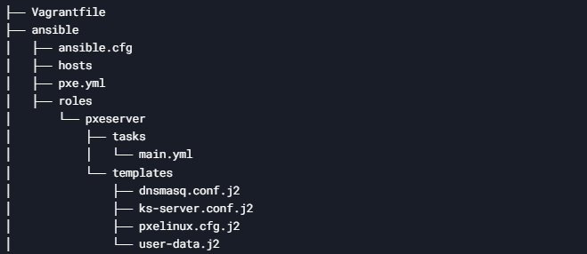
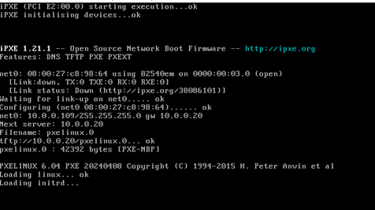
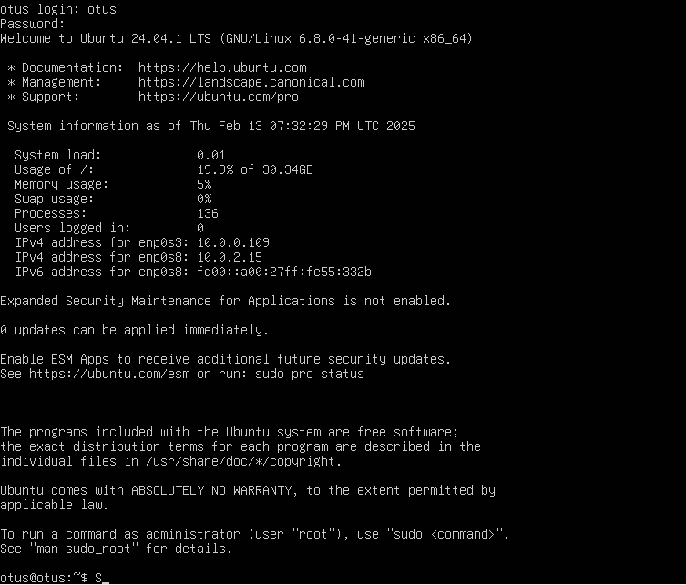

# Домашнее задание DHCP, PXE_Настройка PXE сервера для автоматической установки.

## Цель домашнего задания  
Отработать навыки установки и настройки DHCP, TFTP, PXE загрузчика и автоматической загрузки.

### Описание домашнего задания  

Описание домашнего задания
1. Настроить загрузку по сети дистрибутива Ubuntu 24
2. Установка должна проходить из HTTP-репозитория.
3. Настроить автоматическую установку c помощью файла user-data    
*4. Настроить автоматическую загрузку по сети дистрибутива Ubuntu 24 c использованием UEFI
Задания со звёздочкой выполняются по желанию   

Формат сдачи ДЗ - vagrant + ansible    
   
# Введение   
Бывают ситуации, когда ИТ-специалисту потребуется установить ОС на большом количестве хостов.   
Установка вручную занимает много времени. Один из способов ускорить установку - PXE.   
PXE (Preboot eXecution Environment) — это набор протоколов, которые позволяют загрузить хост из сети.   
Для загрузки будет использоваться сетевая карта хоста.   
Для PXE требуется:   
• Со стороны клиента (хоста на котором будем устанавливать или загружать ОС):   
◦ Cетевая карта, которая поддерживает стандарт PXE   
• Со стороны сервера:   
◦ DHCP-сервер   
◦ TFTP-сервер   
◦ Веб-сервер (не обязательно)   
TFTP (Trivial File Transfer Protocol) — простой протокол передачи файлов, используется главным образом для
первоначальной загрузки бездисковых рабочих станций. Основная задача протокола TFTP — отправка
указанных файлов клиенту.   
TFTP работает на 69 UDP порту. TFTP — очень простой протокол, у него нет аутентификации, возможности
удаления файлов и т д. Протокол может только отправлять запросы на чтение и запись…   
DHCP (Dynamic Host Configuration Protocol) — протокол динамической настройки узла, позволяет сетевым
устройствам автоматически получать IP-адрес и другие параметры, необходимые для работы в сети TCP/IP.   
Протокол DHCP пришёл на смену протоколу BOOTP. DHCP сохраняет обратную совместимость с BOOTP.   
Основное отличие протоколов заключается в том, что протокол DHCP помимо IP-адреса может отправлять
клиенту дополнительные опции (маску подсети, адреса DNS-серверов, имя домена, адрес TFTP-сервера).   
Протокол DHCP использует следующие порты:   
UDP 67 на сервере    
UDP 68 на клиентеТакже DHCP позволяет DHCP-клиенту отправить ответом опции для DHCP-сервера.   
Через DHCP мы можем передать клиенту адрес PXE-сервера и имя файла, к которому мы будем обращаться.    
ОС на базе архитектуры amd64 загружаются либо в режиме UEFI, либо в устаревшем BIOS.    
Разница между UEFI и BIOS заключается в передаче файлов через TFTP и режимах установки:    
• В UEFI используются файлы bootx64.efi и grubx64.efi и конфигурационный файл grub.cfg    
• В BIOS используются файл pxelinux.0 и конфигурационный файл pxelinux.cfg/default    
В данной лабораторной работе будет рассмотренна загрузка по сети с использованием BIOS.   
   


# Выполнение:  

### 1. Изменил Vagrantfile, который был предложен в методичке.   

Добавил развертывание ВМ ansible, т.к. выполнял задание в ОС Windows+Vagrant


### 2. Написал Playbook pxe.yml и создал роль   
   
   


## 2.1 Далее создал пару приватный-публичный ssh ключи, скопировал их в рабочую папку проекта, где находится Vagranfile - это необходимо чтобы ansible подключался к машинам по ssh_key. Выполнил команду vagrant up   
*данную работу выполнял в среде Windows+Vagrant, из-за provision ansible пришлось раскатывать дополнительную ВМ специально для ansible. Другие способы не помогли или не было возможности их реализовать. Поэтому запуск плэйбука будет происходить с этой доп. машины, предварительно загрузив в нее рабочий проект ДЗ*   

```shell
F:\VM\Vagrant\DZ\DHCP_PXE\win> vagrant up
Bringing machine 'pxeserver' up with 'virtualbox' provider...
Bringing machine 'pxeclient' up with 'virtualbox' provider...
Bringing machine 'ansible' up with 'virtualbox' provider...
```   

## 2.2 Подключился к ВМ ansible, извлек из архива проект ДЗ и запустил Playbook pxe.yml    

```shell
root@ansible:/home/vagrant/ansible# ansible-playbook pxe.yml
[WARNING]: Found both group and host with same name: pxeserver

PLAY [pxeserver] **********************************************************************************************

TASK [Gathering Facts] ****************************************************************************************
ok: [pxeserver]
...
PLAY RECAP ****************************************************************************************************
pxeserver                  : ok=16   changed=9    unreachable=0    failed=0    skipped=0    rescued=0    ignored=0

```   
Playbook отработал без ошибок   

## 3. Далее перезапустил сначала pxeserver потом pxeclient, клиент увидел PXE и приступил к установке OS Linux Ubuntu 24   

      


После установки ОС, выключил ВМ клиента, в настройках VB указал загрузку с жесткого диска, запустил ВМ с установленной ОС, выполнил вход в пользователя otus с паролем 123  



__________________   

end